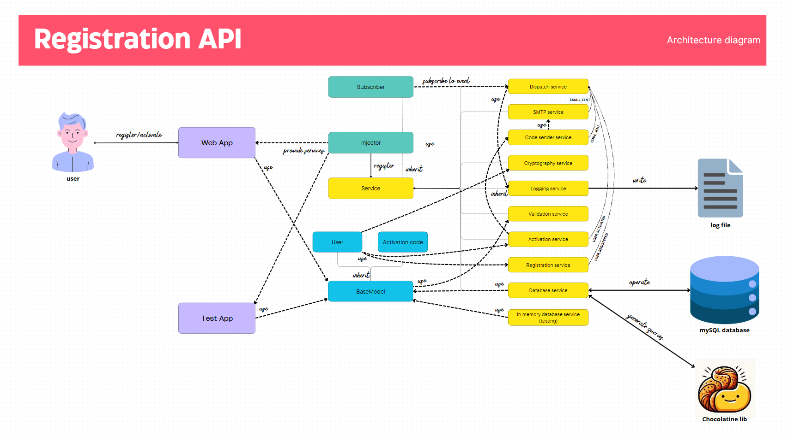

# Registration API

Flask web application to register users and activate accounts with a pin code sent by email.
This application is only intended for the **demonstration** of a clean architecture (but can be improved), without framework except Flask, and with as few libraries as possible.

# Usage

```docker-compose up -d```

# TODO

- Test code style unified
- More events sent to the dispatch service
- Better error system
- Check code test coverage
- Implement CI/CD with github Actions

# Configuration

The following variables must be defined in your environement :

    SMTP_HOST
    SMTP_PORT
    SMTP_USERNAME
    SMTP_PASSWORD
    MYSQL_DB
    MYSQL_USER
    MYSQL_PASSWORD
    MYSQL_URL

NB: You can complete the docker-compose to fit your needs

# Warning

For commodity reasons and because it is a demo, all the database tables are dropped at the application start

# Prerequises

- Python 3.12.4
- Docker & docker-compose

# External libraries

- Chocolatine is a Python library developped by myself (SQL queries generation)
- Bcrypt to encrypt the passwords and compare hashes

# SGBD

- MySQL

# Testing

```pytest```

# Code quality

- Code formatted with Black

# Architecture


